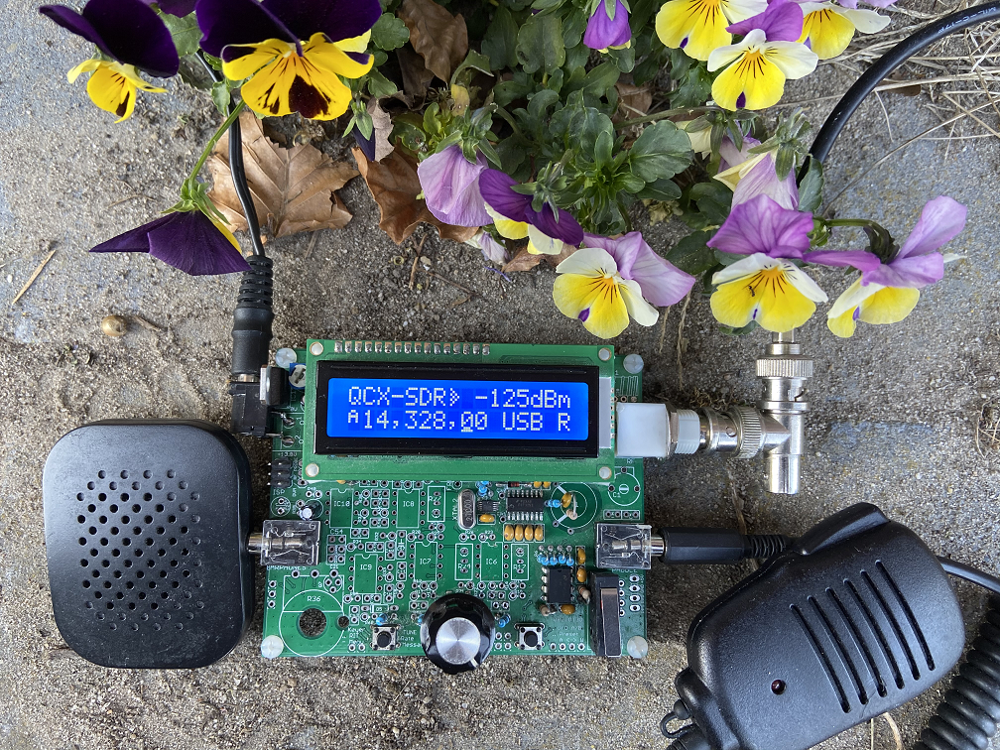
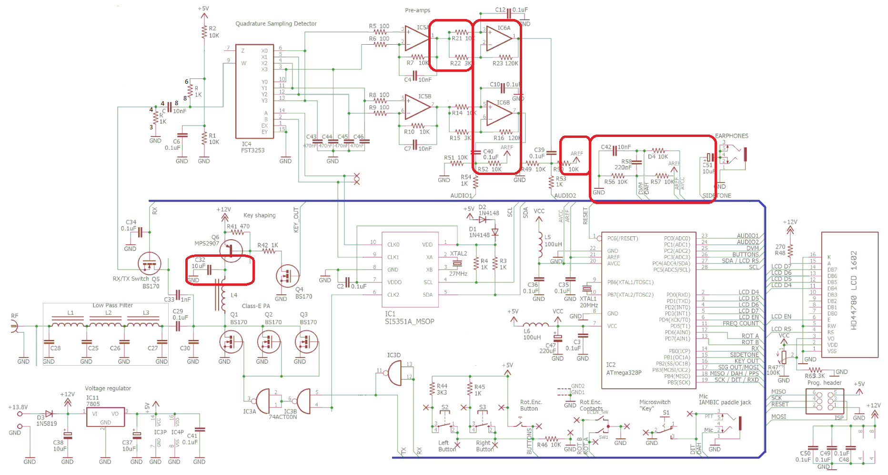
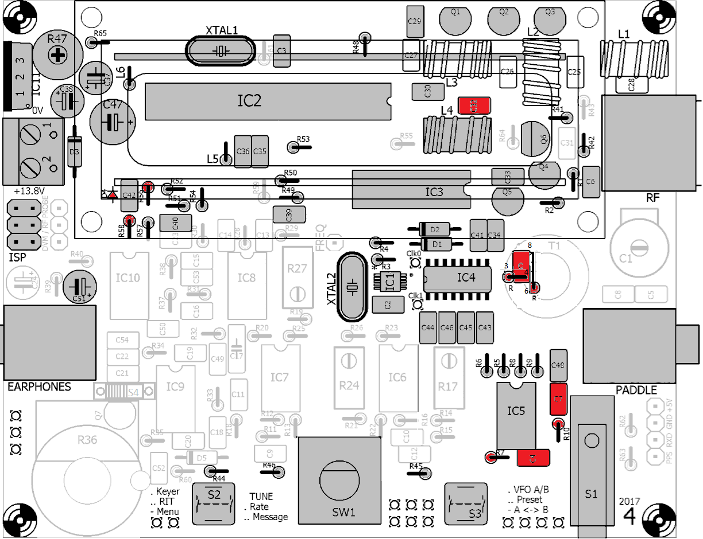
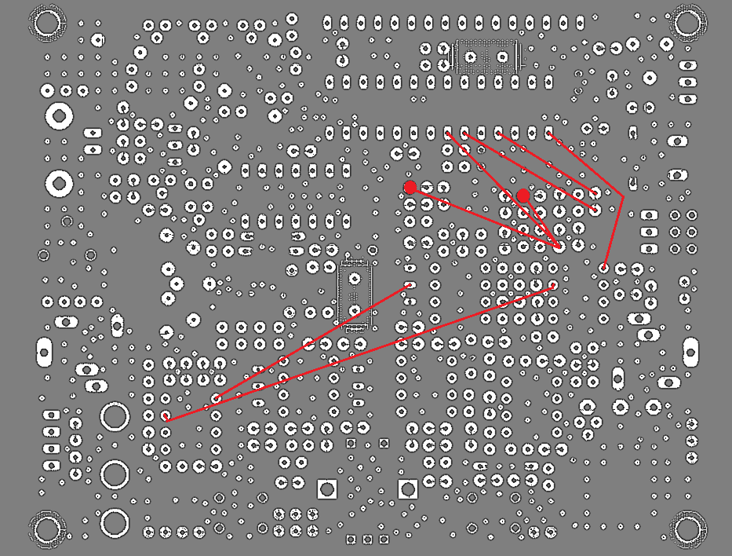
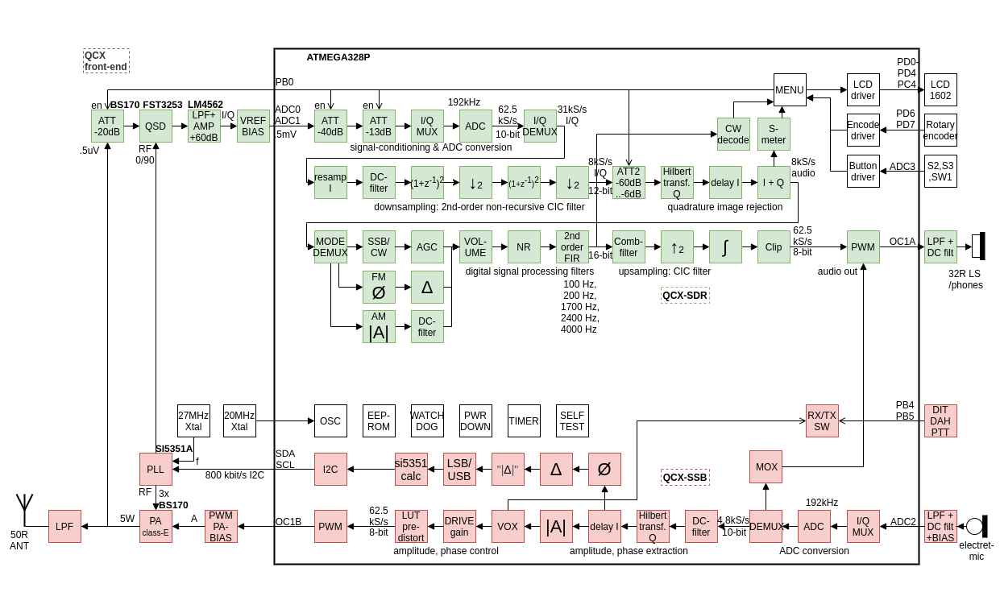
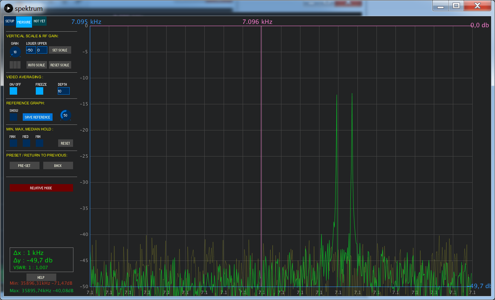

# QCX-SSB: SSB with your QCX transceiver
This is a simple and experimental modification that transforms a [QCX] into a (Class-E driven) SSB transceiver. It can be used to make QRP SSB contacts, or (in combination with a PC) used for the digital modes such as FT8, JS8, FT4. It can be fully-continuous tuned through bands 80m-10m in the LSB/USB-modes with a 2400Hz bandwidth has up to 5W PEP SSB output and features a software-based full Break-In VOX for fast RX/TX switching in voice and digital operations.

The SSB transmit-stage is implemented entirely in digital and software-based manner: at the heart the ATMEGA328P is sampling the input-audio and reconstructing a SSB-signal by controlling the SI5351 PLL phase (through tiny frequency changes over 800kbit/s I2C) and controlling the PA Power (through PWM on the key-shaping circuit). In this way a highly power-efficient class-E driven SSB-signal can be realized; a PWM driven class-E design keeps the SSB transceiver simple, tiny, cool, power-efficient and low-cost (ie. no need for power-inefficient and complex linear amplifier with bulky heat-sink as often is seen in SSB transceivers).

For the receiver, a large portion of the original QCX circuit has been removed and implemented in digital manner (software): the ATMEGA328P is now implementing the 90 degree phase shift circuit, the (CW/SSB) filter circuit and the audio amplifier circuit (now a class-D amplifier). This has simplified the QCX circuit a lot (50% less components needed), and there are a number of advantages and features: there is no longer a need for an alignment procedure due to the very accurate 90 degree Hilbert phase shifter; and there are now adjustable IF DSP filters for CW and SSB; and there is an AGC and there is a noise-reducing DSP signal conditioning function and there are three indepent built-in attenuators in the analog front-end which helps utilizing the full dynamic range. The speaker is directly connected and driven by the ATMEGA. A digital mixer with narrow low-pass window (2 kHz), steep roll-off (-45dB/decade) combined with an oversampling and decimating ADC are responsible for a processing gain, dynamic range and alias rejection sufficient to handle weak and strong signal conditions (e.g. contests or listening on 40m just next to broadcasting band).

This experiment is created to try out what is can be achieved with minimal hardware while moving complexity towards software; here the approach followed is to simplify the design where possible while keep a reasonable performance. The result is a cheap, easy to build, versatile QRP SSB transceiver that actually is quite suitable for making QSOs (even in contest situations), however due to the experimental nature some parts are still in progress and hence limited. Feel free to try it out or to experiment with this sketch, let me know your thoughts or contribute here: https://github.com/threeme3/QCX-SSB  There is a forum discussion on the topic here: [QRPLabs Forum]

73, Guido
pe1nnz@amsat.org

## List of features:
- **[Simple, fun and versatile] QRP SSB HF transceiver** with embedded **DSP and SDR functions**;
- **[EER Class-E]** driven SSB transmit-stage
- Approximately **5W PEP SSB output** from 13.8V supply
- **All-Mode support: USB, LSB, experimental modes: CW, AM, FM**
- **DSP filters: 4000, 2500, 1700, 500, 200, 100, 50 Hz passband**
- **DSP features: Automatic Gain Control (AGC), Noise-reduction (NR), Voice-triggered Xmit (VOX), RX Attentuators (ATT), TX drive control, Volume control, dBm/S-meter.**
- SSB opposite side-band/carrier supression **Transmit: better than -45dBc, IMD3 (two-tone) -33dBc, Receive: better than -50dBc**
- **Multiband** support, continuously tunable through bands **80m-10m** (and from 20kHz..99MHz with loss in performance)
- **Open source** firmware, built with Arduino IDE; allows experimentation, new features can be added, contributions can be shared via Github, software-complexity: 2000 lines of code
- Software-based **VOX** that can be used as **fast Full Break-In** (QSK operation) or assist in RX/TX switching for operating digital modes (no CAT or PTT interface required)
- **Simple to install modification** with **8 component changes and 8 wires**
- **Lightweight and low-cost transceiver design**: because of the EER-transmitter class-E stage it is **highly power-efficient** (no bulky heatsinks required), and has a **simple design** (no complex balanced linear power amplifier required)
- **Fully digital and software-based SSB transmit-stage**: samples microphone-input and reconstruct a SSB-signal by controlling the phase of the SI5351 PLL (through tiny frequency changes over 800kbits/s I2C) and the amplitude of the PA (through PWM of the PA key-shaping circuit)
- **Fully digital and software-based SDR receiver-stages (optionally)**: samples I/Q (complex) signal from Quadrature Sampling Detector digital mixer, and performs a 90-degree phase-shift mathematically in software (Hilbert-transform) and cancels out one side-band by adding them
- Three independent switchable analog front-end **receiver attenuators (0dB, -13dB, -20dB, -33dB, -53dB, -60dB, -73dB)**
- Receiver Noise floor **MDS: –135 dBm** at 28MHz (in 200Hz BW)
- Receiver Front-end selectivity: **steep -45dB/decade roll-off +/-2kHz from tuned-frequency**
- Blocking **dynamic range: 20kHz offset 123dB, 2kHz offset 78dB**
- **CW decoder (experimental).**
- Probably the most **cost effective** and **easy** to build standalone SDR/SSB transceiver that you can find. Very much **simplifies** the original QCX circuit (i.e. **50% less components to install**, **no complex transformer windings**, **no alignment procedure**) and more **versatile** in use.

## Revision History:
| Rev.  | Date       | Features                                                            |
| ----- | ---------- | ------------------------------------------------------------------- |
| R1.02 (**current**) | 2020-04-12 | Integrated SDR receiver, CW decoder, DSP filters, AGC, NR, ATT, experimental modes CW, AM, FM, quick menu, persistent settings, improved SSB TX quality. |
| R1.01d | 2019-05-05 | Q6 now digitally switched (remove C31) - improving stability and IMD. Improved signal processing, audio quality, increased bandwidth, cosmetic changes and reduced RF feedback, reduced s-meter RFI, S-meter readings, self-test on startup. Receiver I/Q calibration, (experimental) amplitude pre-distortion and calibration. **See here [original QCX-SSB modification] (it is also supported by current firmware!)** |
| R1.00 | 2019-01-29 | Initial release of SSB transceiver prototype. |

## Schematic:
Below the schematic after the modification is applied, unused components are left out and changed components are marked in red (click to zoom & download) (link to [original schematic]):

## Installation:
This modification consists of a few component changes and wires:
- **To simplify things, 79 components are no longer needed** (and you could omit them on an unbuilt QCX): IC6-10,R11-40,43,55,R59-64,C1,5,8,C9-28,C31,C52-54,L1-3,D5,Q7,T1,JP1/DVM/FREQ.
- **SDR receiver**: change R7,10(82k); C4,C7(1nF), remove R11,12,14,15,17,27,29,59,IC10; wire IC2(pin15) to IC10(pin1), insert 470R if you intend to use a headphones; C39(R27/R29 side) to IC5(pin1); C40(IC10 side) to IC5(pin7), and disconnect R50(5V side) and R52(5V side) and wire both to IC2(pin21). If you cannot wire C39,R50 then make the following Rev5 mods in addition: remove IC7, change R11(.1uF), C9(10k), R53(1k); wire 10k from R52(IC2-pin21 side) to IC7(pin5); wire R11 (C9 side) to R27(middle). If you want to build-up the original (analog) QCX receiver, you can skip this step and insert a SPDT switch between C21(+ side) and IC9(pin1) for CW and R27(pin2) for SSB (as was done in [original QCX-SSB modification]).
- **SSB transmitter**: change D4,R56 (10k); R58 (.22uF); C32 (10uF), remove C31; wire IC2(pin21) to pin R57(side DVM-pin3); wire IC2(pin20) to DVM(pin2); wire IC2(pin18) to junction D4-C42-R58; install a microphone to tip (+ of electret) and sleeve GND of paddle-jack; PTT-switch to ring and sleeve ([X1M-mic]).
- **Multiband support**: remove C1,5,8,R64,T1; at T1 landing pattern (see [QCX Assembly instruction] T1) install R (1k) over 6-8; R (1k) over 3-4; C (10nF) over 4-8; change C30 (30pF); L4 (1uH/16t); replace C25-28,L1-L3 with LPFs for different bands (e.g. [QRPLabs Low Pass Filter kit]).

**Firmware**: download [latest released hex file] and install with [standard QCX firmware upload procedure] (see also [note 1](#note1)).

Below the (Rev4) layout with components marked in red that needs to be changed; gray components must be installed and blank components may be omitted and some must be remove (see above):

Below the (Rev4) wires that needs to be installed on the bottom PCB. Note that a circle represents resistor R50/R52 that is in series with the wire and the pad at which the circle is drawn (the resistor is no longer connected to its original neighbour pad and its probably the best to place this wiring and resistor at the components side):

See here the completed transceiver with the (Rev4) modifications applied (includes PA bias mod [note 3](#note3), does not include LPFs):

**Build options:**
1. For an unbuilt QCX, the easiest way to build this digital transceiver is to omit the 79 components and apply all above modifications, this will offer you all features described above. If you want to, you can still decide to build the original QCX from here.
2. If you already have a working QCX, the easiest way is to apply the SSB transmit mod and bypass the CW filter with a switch, in this way your transceiver keeps the analog receiver circuit, there are no SDR features, and you can still place the original QRP Labs CW firmware if you prefer.

## Operation:
Currently, the following functions have been assigned to shortcut buttons (L=left, E=encoder, R=right) and menu-items:

| Menu Item           | Function                                     | Button |
| ------------------- | -------------------------------------------- | ------ |
| 1.1 Volume          | Audio level (0..16) & power-off/on | **E +turn** |
| 1.2 Mode            | Modulation (LSB, USB, CW, AM, FM) | **R** |
| 1.3 Filter BW       | Audio passband (Full, 300..4000, 300..2500, 300..1700, 200, 100 Hz) | **R double** |
| 1.4 Band            | Band-switch to pre-defined FT8 freqs (80,60,40,30,20,17,15,12,10,6,4m) | **E double** |
| 1.5 Tuning Rate     | Tuning step size 10M, 1M, 0.5M, 100k, 10k, 1k, 0.5k, 100, 10, 1 | **E or E long** |
| 1.6 AGC             | Automatic Gain Control (ON, OFF) | |
| 1.7 NR              | Noise-reduction level (0-8), load-pass & smooth | |
| 1.8 ATT             | Analog Attenuator (0, -13, -20, -33, -40, -53, -60, -73 dB) | |
| 1.9 ATT2            | Digital Attenuator in CIC-stage (0-16) in steps of 6dB | |
| 1.10 S-meter        | Type of S-Meter (OFF, dBm, S, S-bar) | |
| 2.1 CW Decoder      | Enable/disable CW Decoder (ON, OFF) | |
| 3.1 VOX             | Voice Operated Xmit (ON, OFF) | **R long** | |
| 3.2 VOX Level       | Audio threshold of VOX (0-255) | |
| 3.3 MOX             | Monitor on Xmit (audio unmuted during transmit) | |
| 3.4 TX Drive        | Transmit audio gain (0-8) in steps of 6dB, 8=constant amplitude for SSB | |
| 8.1 Ref freq        | Actual si5351 crystal frequency, used for frequency-calibration | |
| 8.2 PA Bias min     | KEY_OUT PWM level (0-255) for representing   0% RF output | |
| 8.3 PA Bias max     | KEY_OUT PWM level (0-255) for representing 100% RF output | |
| 9.1 Sample rate     | for debugging, testing and experimental purpose | |
| 9.2 CPU load        | for debugging, testing and experimental purpose | |
| 9.3 Param A         | for debugging, testing and experimental purpose | |
| 9.4 Param B         | for debugging, testing and experimental purpose | |
| 9.5 Param C         | for debugging, testing and experimental purpose | |
| main                | Frequency (20kHz..99MHz) | **turn** |
| main                | Quick menu | **L +turn** |
| main                | Menu enter | **L** |
| menu                | Menu back | **R** |

Operating Instructions:

Tuning can be done by turning the rotary encoder. Its step size can be decreased or increased by a short or long press. A change of band can be done with a double press. The mode of operation is altered with a short press on the right button; a double press on right button narrows the receiver filter bandwidth, the bandwidth is reset every time mode is changed. The volume is changed by turning the rotary encoder while pressed.

There is a menu available that can be accessed by a short left press. With the encoder it is possible to navigate through this menu. When you want to change a menu parameter, a press with left button allows you to change the parameter with the encoder. With the right button it is possible to exit the menu any time. A fast access to the menu and parameter can be achieved by pressing the left button while turning the encoder, once you lift the left button you can immediately change the parameter by turning the encoder.

For receive, by default an AGC is enabled. This increases the volume when there are weak signals and decreases for strong signals. This is good for SSB signals but can be annoying for CW operation. The AGC can be turned off in the menu, this makes the receiver less noisy but require more manual volume change. To further reduce the noise, a noise-reduction function can be enabled in the menu with the NR parameter. To use the available dynamic range optimally, you can attenuate incoming signal by enabling a front-end attenuator with "ATT" parameter. Especially on frequencies 3.5-7 MHz the atmospheric noise levels are much higher, so you can increase the receiver performance by adding attenuation (e.g 13dB) such that the noise-floor is still audible. To calibrate the transceiver frequency, you can tune to a calibrated signal source (e.g. WWV on 10 MHz) and zero-beat the signal by changing "Ref freq" parameter; alternatively you can measure the XTal frequency with a counter and set the parameter. A S-meter of choice (dBm, S, S-bar) can be selected with the S-meter parameter. Selecting an S-bar, shows a signal-strength bar where each tick represents a S-point (6dB).

For SSB voice operation, connect a microphone to the paddle jack, a PTT or onboard "key" press will bring the trasnceiver into transmit. With the "TX Drive" parameter, it is possible to set the mdulation depth or PA drive, it is default set to 4 increasing it gives a bit more punch (compression for SSB). Setting it to a value 8 in SSB means that the SSB modulation is transmitted with a constant amplitude (possibly reducing RFI but at the cost of audio quality). To monitor your own modulation, you can temporarily increase MOX parameter. A long press on the right button enters the transceiver in VOX operation, the VOX sensitivity can be configured in the menu with "VOX threshold" parameter. The PA Bias min and max parameters sets the working range of the PWM envelope signal, a range of 0-255 is the full range which is fine if you use a key-shaping circuit for envelope control, but when you directly bias the PA MOSFETs ([note 3](#note3)) with the PWM signal then you specifiy the optimal working range from just above the MOSFET threshold level to the maximum peak power you would like to use (0-180 are good values on my QCX).

For FT8 (and any other digital) operation, select one of the pre-programmed FT8 bands by double press the rotary encoder, connect the headphone jack to sound card microphone jack, sound card speaker jack to microphone jack, and give a long press on right button to enter VOX mode. Adjust the volume to a minimum and start your favorite FT8 application (JTDX for instance). The sensitivity of the VOX can be set in the "VOX threshold" parameter. 

On startup, the transceiver is performing a self-test. It is checking the supply and bias voltages, I2C communications and algorithmic performance. In case of deviations, the display will report an error during startup. It also discovers the capabilties of the transceiver depending on the mods made. The following capabilities are detected and shown on the display: "QCX" for a QCX without mods; "QCX-SSB" for a QCX with SSB mod; "QCX-DSP" for a QCX with SIDETONE disconnected and connected to a speaker (through decoupling capacitor); "QCX-SDR" for a QCX with SDR mod. Please check if the this capability matches with the mods. 

## Technical Description:
The principle of operation (at least what is ging on in the ATMEGA) is a bit as in the following video-fragment: [Opzij] (in Dutch saying; _"Sideways, sideways, sideways, Make room, make room, make room, We are in an incredible rush"_; full [lyrics]) here... :-)  jokes aside; below the block diagram of the QCX-SSB, SDR transceiver:

For SSB reception, the QCX analog phasing receiver stage is replaced with a digital SDR stage; this means that the phase shifting op-amp IC6 is changed into a regular amplifier and whereby the individual I and Q outputs are directly fed into the ATMEGA328P ADC inputs for signal processing. The ATMEGA328P (over-)samples the ADC input at a 62kHz sample-rate, an decimates this high-samplerate to a lower samplerate, performs a phase-shift by means of a Hilbert-transform, summing the result to obtain side-band rejection; it subsequently applies a low-pass filtering, AGC and noise-reduction functions. Since the original QCX phase-shifting network and analog CW filter are not used, about half of the original QCX components can be left out; by combining the function of IC7B into IC6A another op-amp can be saved. The ADC inputs are low-pass filtered (-40dB/decade roll-off at 1.5kHz cut-off) to prevent aliasing and input are biased with a 1.1V analog reference voltage to obtain additional sensitivity and dynamic range. With the 10-bit ADCs and a 4x over-sampling rate, a theoretical dynamic range of 72dB can be obtained in 2.4kHz SSB bandwidth. LSB/USB mode switching is done by changing the 90 degree phase shift on the CLK0/CLK1 signals of the SI5351 PLL. Three embedded attenuators are available for optimally using dynamic range; the first attenuator is the RX MOSFET switch Q6 responsible for 20dB attenuation, the second attenuator is ADC range (1.1V or 5V) selected by the ATMEGA ADC analog reference (AREF) logic and is responsible for 13dB attenation, the third attenuator is a pull-down of an analog input on the ATMEGA with a GPIO port responsible for 53dB attenation. Combining the three attenuators provides the attenation steps 0dB, -13dB, -20dB, -33dB, -53dB, -60dB, -73dB.

For SSB transmission the QCX DVM-circuitry is changed and used as an audio-input circuit. An electret-microphone (with PTT switch) is added to the Paddle jack connecting the DVM-circuitry, whereby the DOT input acts as the PTT and the DASH input acts as the audio-input. The electret microphone is biased with 5V through a 10K resistor. A 10nF blocking capacitor prevents RF leakage into the circuit. The audio is fed into ADC2 input of the ATMEGA328P microprocessor through a 220nF decoupling capacitor. The ADC2 input is biased at 0.55V via a divider network of 10K to a 1.1V analog reference voltage, with 10-bits ADC resolution this means the microphone-input sensitivity is about 1mV (1.1V/1024) which is just sufficient to process unamplified speech.

A new QCX-SSB firmware is uploaded to the ATMEGA328P, and facilitates a [digital SSB generation technique] in a completely software-based manner. A DSP algorithm samples the ADC2 audio-input at a rate of 4x4800 samples/s, performs a Hilbert transformation and determines the phase and amplitude of the complex-signal; the phase-changes are restricted[note 2](#note2) and transformed into either positive (for USB) or negative (for LSB) phase changes which in turn transformed into temporary frequency changes which are sent 4800 times per second over 800kbit/s I2C towards the SI5351 PLL. This result in phase changes on the SSB carrier signal and delivers a SSB-signal with a bandwidth of 2400 Hz whereby spurious in the opposite side-band components is attenuated. 

The amplitude of the complex-signal controls the supply-voltage of the PA, and thus the envelope of the SSB-signal. The key-shaping circuit is controlled with a 32kHz PWM signal, which can control the PA voltage from 0 to about 12V in 256 steps, providing a dynamic range of (log2(256) * 6 =) 48dB in the SSB signal. C31 is removed to ensure that Q6 is operating as a digital switch, this improves the efficiency, thermal stability, linearity, dynamic range and response-time. Though the amplitude information is not mandatory to make a SSB signal intelligable, adding amplitude information improves quality. The complex-amplitude is also used in VOX-mode to determine when RX and TX transitions are supposed to be made. Instead of using a key-shaping circuit for evelope control, it is possible to directly bias the PA MOSFETs with the (filtered) PWM signal. This has the advantage of less losses and simplifies at the cost of linearity which result in more compression for an SSB signal (which is actually a good thing).

The IMD performance is related dependent on the quality of the system: the linearity (accuracy) of the amplitude and phase response and the precision (dynamic range) of these quantities. Especially the DSP bit-width, the precision used in the DSP algorithms, the PWM and key-shaping circuit that supplies the PA and the PA phase response are critical. Decreasing (or removing) C32 improves the IMD characteristics but at the cost of an increase of PWM products around the carrier.

## Results
Here is a [sample] me calling CQ on 40m with my QCX-SSB at 5W and received back by the Hack Green websdr about 400km away, note that the audio quality has further improved since then.

Several OMs reported a successful QCX-SSB modification and were able to make SSB QRP DX contacts over thousands of kilometers on the 20m and 40m bands. During CQ WW contest I was able to make 34 random QSOs on 40m with 5W and an inverted-V over the house in just a few hours with CN3A as my furthest contact, I could observe the benefits of using SSB with constant-envelope in cases where my signal was weak; for FT8 a Raspberry Pi 3B+ with JTDX was used to make FT8 contacts all the way up to NA.

Measurements:
The following performance measurements were made with QCX-SSB R1.01, a modified RTL-SDR, Spektrum-SVmod-v0.19, Sweex 5.0 USB Audio device and Audicity player. It is recognized that this measurement setup has its own limitations, hence the dynamic range of the measurements is somewhat limited by the RTL-SDR as this device goes easily into overload. Measurements were made with the following setttings: USB modulation, no pre-distortion, two-tone input 1000Hz/1200Hz where audio level is set just before the point where compression starts. Results:
- Intermodulation distortion products (two-tone; SSB with varying  envelope) IMD3, IMD5, IMD7: respectively -33dBc; -36dBc; -39dBc
- Intermodulation distortion products (two-tone; SSB with constant envelope) IMD3, IMD5, IMD7: respectively -16dBc; -16dBc; -19dBc
- Opposite side-band rejection (two-tone): better than -45dBc
- Carrier rejection (two-tone): better than -45dBc
- Wide-band spurious (two-tone): better than -45dBc
- 3dB bandwidth (sweep): 0..2400Hz

### Notes:
1. <a name="note1"/>Firmware upload variations:
- [AVRDudess] tool or avrdude CLI (avrdude -c avrisp -b 19200 -P /dev/ttyACM0 (or: /dev/ttyUSB0) -p m328p -e -U efuse:w:0xFD:m -U hfuse:w:0xD1:m -U lfuse:w:0xF7:m -U flash:w:R1.0xx.hex) can be used for uploading the firmware via the ISP connector on the QCX. Follow [Arduino as ISP] instructions if you have a Arduino UNO board available (tip: use female-to-male breadboard cables to connect Arduino to QCX ISP jumper); or [USBasp] instructions if you have a USBasp programmer, alternatively use [USPasp ExtremeBurner]; but many other ISP programmers can be used in similar manner such as [USBtiny] or AVRisp mkII. During ISP, mic should be disconnected, power supply should be connected; in tool do not erase, program EEPROM or set fuse settings (they are by default ok: E=FD H=D1 L=F7).
- Alternatively, in case you have an ATMEGA328P chip with Arduino bootloader, you can place the chip in an Arduino UNO board and upload directly (without the need for a ISP cable and QCX) by specifying 'arduino' programmer and baudrate 115200.
- Alternatively, in case you have an [Arduino 1.8.9] (or newer) environment installed, you can upload the [QCX-SSB Sketch] directly from the Arduino environment (without using AVRDudess and firmware file); make sure "Tools > Board > Arduino/Genuino Uno",  "Tools > Port > /dev/ttyUSB0 or ttyACM0", and then "Sketch > Upload" is selected, while the ATMEGA328P chip is placed in the Arduino UNO socket. It is also possible to use [Arduino as ISP] method: upload this variation of [ArduinoISP] to the Arduino board and select "Tools > Programmer > Arduino as ISP", and "Sketch > Upload Using Programmer".
2. <a name="note2"/>The occupied SSB bandwidth can be further reduced by restricting the maximum phase change (set MAX_DP to half a unit-circle _UA/2 (equivalent to 180 degrees)). Audio-input can be attenuated by increasing parameter MIC_ATTEN (6dB per step).
3. <a name="note3"/>Alternatively, the PA MOSFETs can be directly biased by the PWM envelope signal, basically making the key-shaping circuit redundant. To do so, Q6,Q4,R41,R42,C32,C31 can be removed entirely, whereby C-E pads of Q6 are wired, and where a 100nF capacitor is inserted at IC3A-pin3 and G of Q1-3, and where a 10k resistor is placed at G-D pads of Q4, a 10nF capacitor between S-D pads of Q4, and where a 10k resistor is placed between D of Q4 and G of Q1-3.

### Credits:
[QCX] (QRP Labs CW Xcvr) is a kit designed by _Hans Summers (G0UPL)_, originally built for RSGB's YOTA summer camp 2017, a high performance, image rejecting DC transceiver; basically a simplified implementation of the [NorCal 2030] by _Dan Tayloe (N7VE)_ designed in 2004 combined with a [Hi-Per-Mite] Active Audio CW Filter by _David Cripe (NMØS)_, [Low Pass Filters] from _Ed (W3NQN)_ 1983 Articles, a key-shaping circuit by _Donald Huff (W6JL)_, a BS170 switched [CMOS driven MOSFET PA] architecture as used in the [ATS] designs by _Steven Weber (KD1JV)_ (originating from the [Power MOSFET revolution] in the mid 70s), and combined with popular components such as Atmel [ATMEGA328P] microprocessor, a Hitachi [HD44780] LCD display and a Silicon Labs [SI5351] Clock Generator (and using a [phase shift in the SI5351 clocks]). The [QCX-SSB] transmitter and QCX-SDR receiver stage both running on a ATMEGA328P, including its multiband front-end and direct PA biasing/envelope-generation technique; its concept, circuit, code and modification to run on a QCX are a design by _Guido (PE1NNZ)_; the software-based SSB transmit stage is a derivate of earlier experiments with a [digital SSB generation technique] on a Raspberry Pi. Many thanks to all of you who got interested in this project and took the challege and effort to try out QCX-SSB. Without your valuable feedback the project could not have kept moving on, improving and challenging new ideas!

<!---
### References
- VERON association interviewed me in the [PI4AA June issue] about this project (in Dutch, starting at timestamp 15:50).
- Rüdiger Möller, HPSDR presentation by [DJ1MR], 2018. Transmitter architectures for high efficiency amplification
- [Arduino PWM]
- [Serial interface]
-->
[Simple, fun and versatile]: ucx.png

[original schematic]: https://qrp-labs.com/images/qcx/HiRes.png

[QCX-SSB]: https://github.com/threeme3/QCX-SSB

[QCX-SSB Sketch]: QCX-SSB.ino

[latest released hex file]: https://github.com/threeme3/QCX-SSB/releases

[original QCX-SSB modification]: https://github.com/threeme3/QCX-SSB/tree/R1.01d

[2-stage QCX-SDR modification]: https://github.com/threeme3/QCX-SSB/tree/653e2d8c387138d30269ffd003065be78cc648ca

[standard QCX firmware upload procedure]: https://www.qrp-labs.com/qcx/qcxfirmware.html

[USBasp]: https://sites.google.com/site/g4zfqradio/qrplabs_program_chip_with_USBasp

[USPasp ExtremeBurner]: https://groups.io/g/QRPLabs/topic/57461404#40024

[USBtiny]: https://groups.io/g/QRPLabs/attachment/40315/0/QCX%20Firmware%20Update%20Instructions.pdf

[Arduino as ISP]: https://qrp-labs.com/images/qcx/HowToUpdateTheFirmwareOnTheQCXusingAnArduinoUNOandAVRDUDESS.pdf

[AVRDudess]: http://zakkemble.net/avrdudess

[Arduino]: https://www.arduino.cc/en/main/software#download

[Arduino 1.8.9]: https://www.arduino.cc/en/Main/OldSoftwareReleases#previous

[ArduinoISP]: https://raw.githubusercontent.com/adafruit/ArduinoISP/master/ArduinoISP.ino

[digital SSB generation technique]: http://pe1nnz.nl.eu.org/2013/05/direct-ssb-generation-on-pll.html

[QCX]: https://qrp-labs.com/qcx.html

[X1M-mic]: https://vignette.wikia.nocookie.net/x1m/images/f/f1/X1M_mic_pinout_diagram.jpg/revision/latest?cb=20131028014710

[QRPLabs Forum]: https://groups.io/g/QRPLabs/topic/29572792

[Norcal 2030]: http://www.norcalqrp.org/nc2030.htm

[Hi-Per-Mite]: http://www.4sqrp.com/hipermite.php

[Low Pass Filters]: http://www.gqrp.com/harmonic_filters.pdf

[CMOS driven MOSFET PA]: http://www.ka7oei.com/mpm_class_e.html

[Power MOSFET revolution]: https://archive.org/details/VMOSSiliconixOCR/page/n17

[ATS]: https://groups.yahoo.com/neo/groups/AT_Sprint/files/AT%20Sprint%20/

[Intelligibility]: https://g8jnj.webs.com/speechintelligibility.htm

[SI5351]: https://www.silabs.com/documents/public/application-notes/AN619.pdf

[ATMEGA328P]: http://ww1.microchip.com/downloads/en/DeviceDoc/ATmega48A-PA-88A-PA-168A-PA-328-P-DS-DS40002061A.pdf

[HD44780]: https://www.sparkfun.com/datasheets/LCD/HD44780.pdf

[sample]: https://youtu.be/-QfMQulk0eA

[PI4AA June issue]: https://cdn.veron.nl/pi4aa/2019/PI4AA_Uitzending20190607.mp3

[EER Class-E]: https://core.ac.uk/download/pdf/148657773.pdf

[MBF]: https://www.arrl.org/files/file/QEX_Next_Issue/Mar-Apr2017/MBF.pdf

[Polar-transmitter]: https://sigarra.up.pt/fcup/pt/pub_geral.show_file?pi_doc_id=25850

[DJ1MR]: https://www.youtube.com/watch?v=A6ohr98ikeA

[RX3DPK]: https://www.facebook.com/photo.php?fbid=2382353591830446&set=pcb.2382353628497109&type=3&theater

[QRP-BR]: https://groups.io/g/QRP-BR/topic/gerando_ssb_digitalmente/29628623

[Opzij]: https://youtu.be/uN706PiFLm0

[lyrics]: https://www.google.com/search?q=lyrics+opzij

[phase shift in the SI5351 clocks]: https://www.silabs.com/community/timing/forum.topic.html/difficulty_settingp-LchG

[QCX Assembly instruction]: https://www.qrp-labs.com/images/qcx/assembly_A4_Rev_4b.pdf

[PCB Revision]: https://www.qrp-labs.com/qcx

[QRPLabs Low Pass Filter kit]: https://www.qrp-labs.com/lpfkit.html

[Arduino PWM]: http://interface.khm.de/index.php/lab/interfaces-advanced/arduino-dds-sinewave-generator/

[Serial interface]: https://groups.io/g/QRPLabs/attachment/40706/0/connections.png

